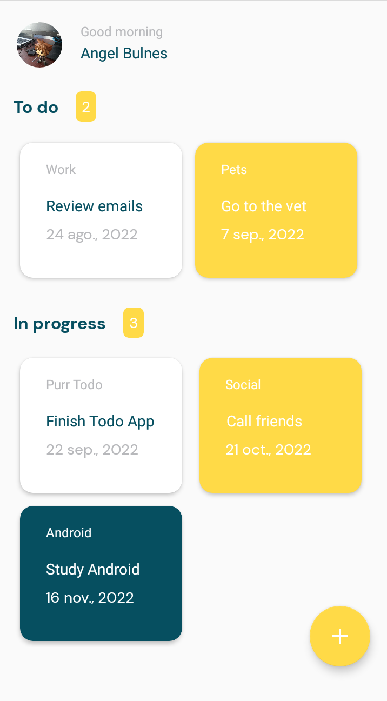
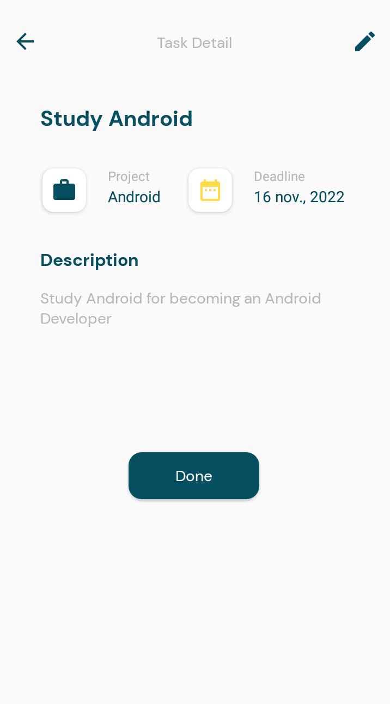
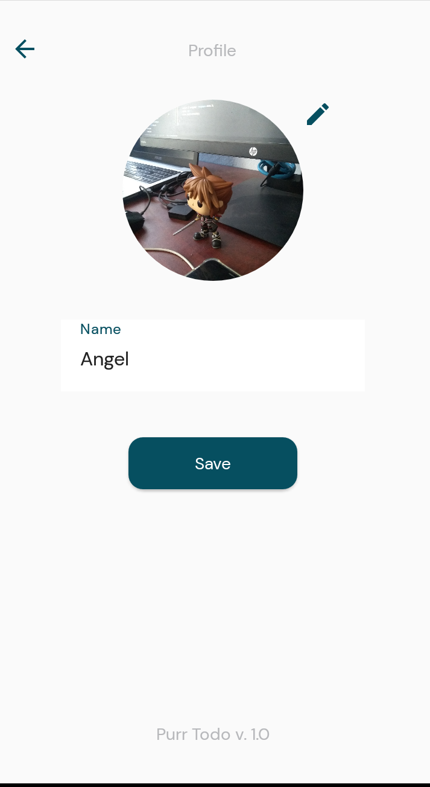

# Purr Todo App

Purr Todo is an app for managing TO-DO Task, you can create, edit and delete the task, mark it as in
progress and done. Also you can configure some preferences for your profile like name and profile
picture.

This app was created to practice the next topics on Android Development:

1. Android Layouts with XML
2. Styling and themes
3. Fragments
4. Navigation components
5. Room database
6. DataStore Preferences

This app is inspired in the design of
the [PurrWeb UX/UI Studio To-Do List App](https://dribbble.com/shots/18226700-To-Do-List-App) on
Dribble

---

## Preview

 
<table>
<tr>
  <td>
  
  </td>
  <td>
 
  </td>
</tr>
<tr>
<td></td>
<td></td>
</tr>
</table>

---

 

## Feedback

If you have any feedback please let me know at [@abulnes16](https://twitter.com/abulnes16) :D